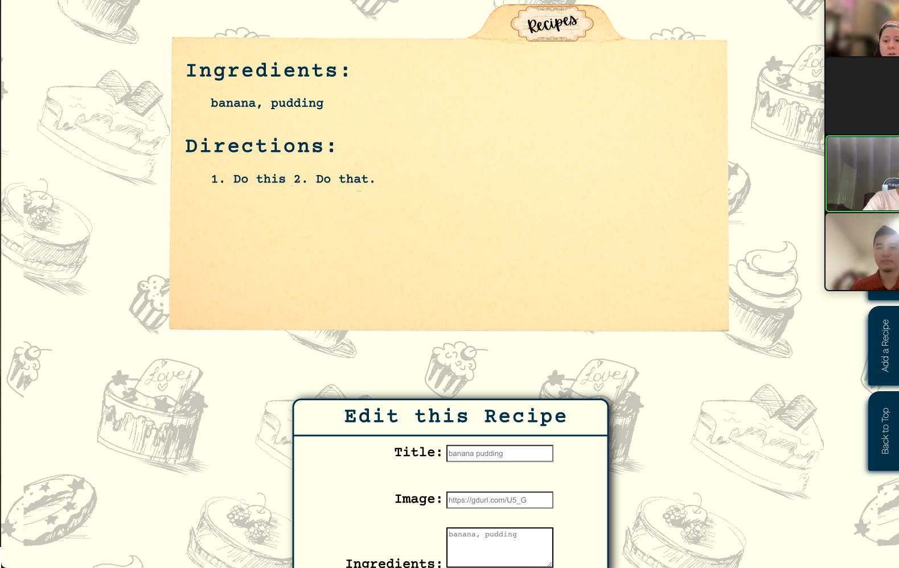
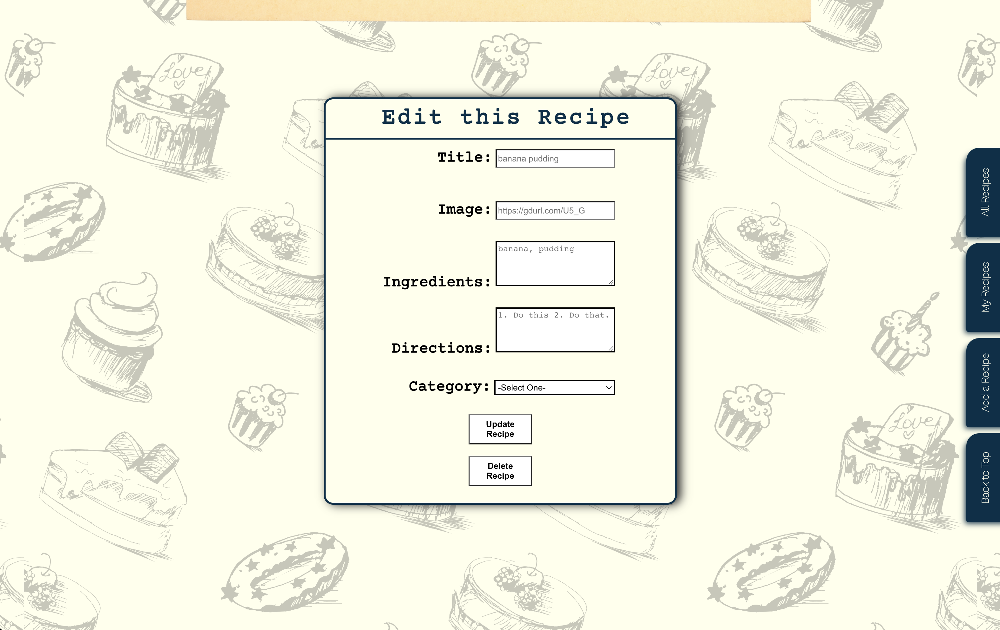
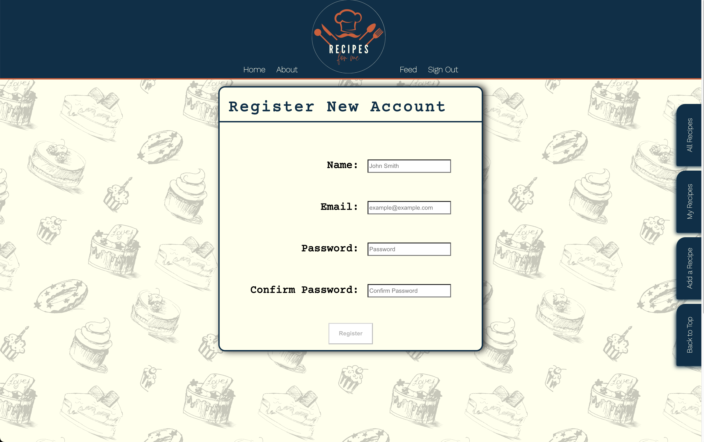

# Recipes-For-Me

# Date: 8/10/2022

## By: Jennifer Griffin [GitHub](https://github.com/jengriffin) [LinkedIn](https://www.linkedin.com/in/jennifer-griffin-12/)/ Cedric Mun [GitHub](https://github.com/Aonmonomer)[LinkedIn](https://www.linkedin.com/in/cedricmun/)/ Josh Langner [GitHub](https://github.com/jlangner87) [LinkedIn](https://www.linkedin.com/in/josh-langner/)/ Jackson McHugh [GitHub](https://github.com/Jacksonmchugh) [LinkedIn](https://www.linkedin.com/in/jackson-mchugh/)

---

## **_Links:_**

## Link to Recipe-For-Me: [Recipe-For-Me](https://obscure-reef-40887.herokuapp.com/home)[Back-end-server](https://recipes-for-me-api.herokuapp.com/)

[Trello Progress](https://trello.com/b/DfpSJLep/recipes-for-me) | [GitHub](https://github.com/Aonmonomer/Recipe-For-Me-Backend) |[GitHub](https://github.com/jengriffin/Recipes-For-Me-)

---

## **_Description_**

### A recipe website tailor made for all dietary needs and healthy choices! Users can browse the webpages for various recipes and login to add their own recipe to the collections online. Users can also subsequently update and delete their posted recipes.

---

## **_Screenshots_**

## 

## ![Add a Recipe] (./assets/Screen Shot 2022-08-19 at 8.16.14 AM.png)

## 

## 

## 

## 

---

## **_Technologies_**

- ## HTML
- ## CSS
- ## JavaScript
- ## React
- ## Postgres
- ## Sequelize
- ## Heroku

---

---

## **_Getting Started_**

Fork and Clone
npm i

---

## **_Credits_**

## Project progression: [trello.com](https://trello.com/b/DfpSJLep/pern-application)

## Project guide: [github.com](https://github.com/Aonmonomer/Recipe-For-Me-Backend)

## HTML and CSS guide: [w3schools.com](https://www.w3schools.com/)

## Drawing ERD and component diagram: [draw.io](https://app.diagrams.net/)

## Image hosting: [imgbb.com](https://imgbb.com/)

## Website deployment: [heroku.com](https://dashboard.heroku.com)

## Image resources: [google.com](https://www.google.com/)

## Refresh Page [upmostly.com](https://upmostly.com/tutorials/how-to-refresh-a-page-or-component-in-react)

## Styling [css-tricks.com](https://css-tricks.com/snippets/css/complete-guide-grid/)

## Back to Top[css-tricks.com](https://css-tricks.com/need-to-scroll-to-the-top-of-the-page/#:~:text=You%20might%20need%20to%20trigger,element)%20back%20to%20the%20top)

## Logo Design[canva.com](https://www.canva.com/)

## Color Scheme [coolors.com](https://coolors.co/)

## Sequlize Migrations on Heroku[stack overflow](https://stackoverflow.com/questions/22633618/sequelize-migrations-in-heroku)
